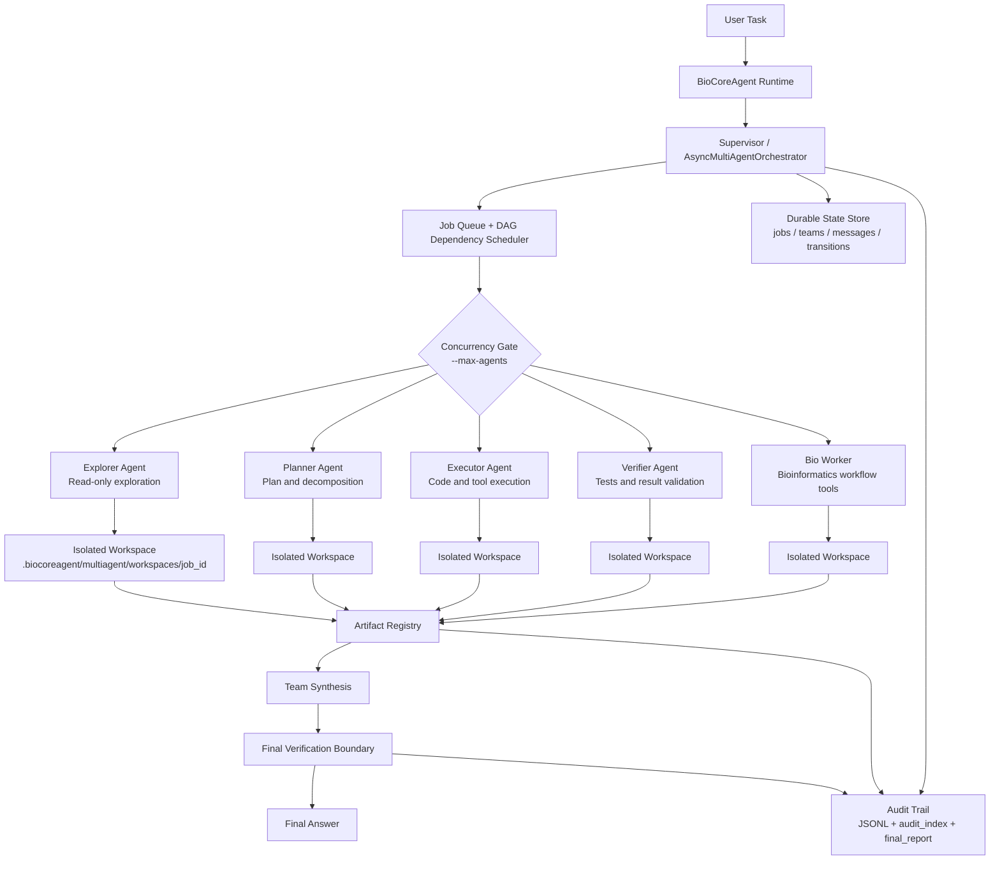

# BioCoreAgent 多 Agent Harness 设计文档

## 1. 一句话说明

BioCoreAgent 的多 Agent 方案不是让多个 Agent 自由聊天，而是用一个中心化 Supervisor 管理角色、权限、状态、并发、产物和审计，让科研 coding 与生信分析任务可以被拆分、执行、验证、恢复和复盘。

## 2. 我们为什么需要多 Agent

BioCoreAgent 面向的是科研代码、文献调研、生信分析和本地工具执行。这类任务有几个特点：

- 任务链条长：通常包含检查输入、制定方案、写代码、运行工具、验证结果、生成报告。
- 风险边界不同：读文件、写脚本、安装依赖、SSH、覆盖结果的风险完全不同。
- 需要证据链：科研任务不能只输出结论，还要保存输入、参数、代码、日志、结果和引用。
- 容易进入工具循环：如果让一个 Agent 自由处理所有阶段，容易反复读文件、反复运行失败命令。
- 需要并发但不能失控：探索、规划和验证可以并发，但最终决策必须统一。

所以我们的多 Agent 目标不是“显得智能”，而是把复杂任务拆成可控、可审计、可恢复的工程流程。

## 3. 总体架构

我们采用：

```text
Central Supervisor + Role-restricted Workers + Durable State + Artifact Registry + Audit Trail
```

核心思想：

- Supervisor 负责调度，不直接把任务扔给一群 Agent 自由讨论。
- Worker 负责局部任务，每个 Worker 有明确角色和工具权限。
- State Store 保存 job、team、transition、message、artifact。
- Artifact Registry 记录每个 Agent 产出的文件。
- Audit Trail 记录状态转移、工具调用、审批、错误和最终产物。

## 4. 架构图



## 5. 当前代码落点

当前实现主要在：

```text
biocoreagent/orchestrator.py
biocoreagent/runtime.py
biocoreagent/audit.py
tests/test_multiagent_orchestrator.py
docs/multiagent_design.md
```

关键类：

```text
AsyncMultiAgentOrchestrator
JsonStateStore
AgentJob
AgentTeam
AgentArtifact
AgentTransition
AuditTrail
```

## 6. Agent 角色设计

### 6.1 Explorer Agent

职责：

- 浏览目录
- 读取文件
- 搜索代码
- 检查输入数据
- 查询已有 skill/wiki/能力注册表

输入：

- 用户任务摘要
- 当前 workspace 信息
- 需要探索的文件或目录

输出：

- 输入数据概况
- 关键文件路径
- 风险点
- 缺失信息

权限：

- 只读为主
- 不允许写文件
- 不允许执行高风险命令

退出条件：

- 已列出关键事实
- 或明确说明信息不足

### 6.2 Planner Agent

职责：

- 把用户目标转成计划
- 拆分任务阶段
- 选择工具路径
- 定义验收标准

输入：

- 用户目标
- Explorer 输出
- 能力注册表
- 项目约束

输出：

- `plan.md`
- `plan.json`
- delegation plan

权限：

- 可读文件
- 可写计划文件
- 不负责正式执行高风险命令

退出条件：

- 计划生成
- 等待用户审批
- 或报告无法规划的原因

### 6.3 Executor Agent

职责：

- 根据计划写代码、脚本或配置
- 调用工具执行任务
- 生成结果文件

输入：

- 已审批计划
- 相关文件路径
- 参数和目标输出

输出：

- 代码文件
- 分析脚本
- 日志
- 结果表
- 中间 summary

权限：

- 可以写文件
- 可以执行允许的命令
- 环境修改、安装依赖、SSH、覆盖结果必须审批

退出条件：

- 产物生成并登记
- 或执行失败并给出 blocker

### 6.4 Verifier Agent

职责：

- 检查结果是否真的存在
- 运行测试
- 校验日志和输出
- 防止“失败但声称完成”

输入：

- Executor 产物
- 日志
- 验收标准

输出：

- 验证报告
- 通过/失败结论
- 最小修复建议

权限：

- 只读为主
- 可运行测试或检查命令
- 不应直接修改被验证对象

退出条件：

- 验证通过
- 验证失败
- 或需要人工确认

### 6.5 Bio Worker

职责：

- 面向生信任务执行领域工具
- 例如转录组、文献调研、数据检查、结果导出

输入：

- 数据路径
- 分组信息
- 分析目标
- workflow plan

输出：

- 生信分析结果
- 标准化 summary
- provenance

权限：

- 可调用生信工具
- 高风险环境操作必须审批

退出条件：

- 结果文件和 summary 生成
- 或明确说明环境、数据、方法阻塞

## 7. Agent 协作流程

典型流程：

```text
用户提出任务
-> Supervisor 判断是否需要多 Agent
-> 创建 Team
-> 生成多个 AgentJob
-> 根据 DAG 依赖调度
-> Worker 在独立 workspace 中执行
-> Worker 输出 result.md
-> Artifact Registry 注册结果
-> Supervisor 读取所有结果
-> 生成 team synthesis
-> Verifier 或 Supervisor 做最终边界判断
-> 输出最终答案
```

并发不是默认目的。只有当任务可以独立拆分时才并发，例如：

- Explorer 检查数据
- Planner 设计方案
- Verifier 后台跑测试
- Bio Worker 执行特定分析

如果任务很小，单 Agent 更稳，不强行多 Agent。

## 8. 状态机设计

每个 `AgentJob` 有统一状态：

```text
created
-> queued
-> running
-> completed
```

异常路径：

```text
running -> failed
queued  -> cancelled
running -> cancelled
queued/running -> blocked
failed/cancelled/blocked -> retry -> queued
```

状态转移保存为：

```text
.biocoreagent/multiagent/transitions/<job_id>.jsonl
```

同时写入统一审计：

```text
.biocoreagent/audit/sessions/multiagent/state_transitions.jsonl
```

这样系统可以回答：

- 任务什么时候开始？
- 谁执行了？
- 为什么失败？
- 是否重试过？
- 最终是否完成？

## 9. 上下文传递策略

我们采用“摘要传递 + artifact 传递”，不是完整上下文广播。

Worker 拿到：

- 自己的任务说明
- 所属 team objective
- 上游依赖的结果摘要
- 定向 message
- 必要文件路径

Worker 不拿：

- 所有历史对话
- 其他 Agent 的隐藏推理
- 无关工具日志

原因：

- 降低 token 成本
- 降低噪音
- 减少错误传播
- 让产物比对话更可信

## 10. 权限控制

权限由 `ROLE_TOOL_POLICIES` 控制。

示例：

```text
explorer: read/search/inspect
planner: read/search/plan
executor: broad execution tools
verifier: read/test/verify
bio_worker: bioinformatics tools
```

高风险操作必须 human-in-the-loop：

- 安装依赖
- 升级 R/Python 包
- 修改全局环境变量
- SSH 远程执行
- 上传原始数据
- 覆盖已有结果
- 删除文件
- 长时间高资源任务
- 调用付费 API

## 11. 存储结构

多 Agent 状态：

```text
.biocoreagent/multiagent/
├── jobs/
├── teams/
├── messages/
├── transitions/
├── artifacts/
└── workspaces/
```

统一审计：

```text
.biocoreagent/audit/sessions/multiagent/
├── events.jsonl
├── messages.jsonl
├── state_transitions.jsonl
├── artifacts.jsonl
├── audit_index.json
└── final_report.md
```

Worker 独立运行数据：

```text
.biocoreagent/multiagent/workspaces/<job_id>/
├── result.md
└── .biocoreagent/
    ├── sessions/
    ├── runs/
    └── audit/
```

## 12. 可观测性

我们保留四类证据：

- `transition`：状态如何变化
- `artifact`：生成了什么文件
- `message`：Agent 间传递了什么消息
- `audit`：谁做了什么、何时做、是否成功

用户可以通过工具查看：

```text
agent_status
agent_team_status
agent_artifacts
```

也可以直接查看落盘文件。

## 13. 错误恢复

恢复策略：

- queued job 可以取消
- terminal job 可以 retry
- worker 异常后按 `max_retries` 重试
- running job 在 orchestrator 重启后标记为 failed
- failed job 不假装继续运行，必须显式 retry
- team 中上游失败，下游依赖任务进入 blocked

这样避免了“后台任务实际已经死了，但用户还以为它在跑”。

## 14. 为什么不用自由群聊式多 Agent

自由群聊的问题：

- 通信成本高
- 很难定义谁负责
- 冲突结果难仲裁
- 难以审计
- 容易互相循环
- 不适合工具执行和生信分析

我们的方案更像工程调度系统：

- 有角色
- 有权限
- 有状态
- 有依赖
- 有产物
- 有最终决策者

这比“多个 Agent 聊天”更适合科研 coding。

## 15. 当前局限

当前版本已经具备真实 multi-agent harness，但还有升级空间：

- 现在 workspace 隔离是目录级，不是 Git worktree 级。
- 冲突处理主要靠 Supervisor 规则和 Verifier，不是复杂仲裁器。
- Agent 间消息是持久化 message bus，但不是实时流式协作。
- 还没有独立 Web UI 查看状态图。
- 还没有基于历史成功率的 Agent 自动选择策略。
- 还没有把每类 artifact 做成强类型 schema。

这些不是设计缺陷，而是阶段性取舍。当前优先保障可控、可审计和可恢复。

## 16. 面试问题与回答

### Q1：你们这个多 Agent 是真多 Agent 吗？

A：是，但不是群聊式多 Agent，而是中心化编排式多 Agent。我们有真实的 Supervisor、独立 worker、角色权限、并发调度、DAG 依赖、状态持久化、artifact 注册和审计记录。每个 worker 都会创建自己的 session、run store 和 workspace，因此不是 prompt 里假装分角色。

### Q2：为什么不直接用 AutoGen 或 CrewAI？

A：AutoGen 和 CrewAI 更适合快速构建角色协作 demo 或开放式讨论，但 BioCoreAgent 更重视工具执行、安全边界、审计、恢复和科研产物。我们已经有 Pico runtime、approval、workspace、trace、domain tools 和 recovery，所以选择在现有 runtime 上实现轻量 supervisor，能更好复用已有工程能力。

### Q3：为什么选择中心化 Supervisor？

A：因为科研 coding 任务需要最终责任人。多个 Agent 可以并发执行局部任务，但最终是否完成、结果是否可信、是否需要人工确认，必须由 Supervisor 根据 artifact 和 verifier 结果判断。中心化设计降低了冲突和循环风险。

### Q4：每个 Agent 的职责怎么划分？

A：Explorer 负责只读探索，Planner 负责计划，Executor 负责执行，Verifier 负责验证，Bio Worker 负责领域分析。每个 Agent 的输入、输出、权限和退出条件都不同，这样可以避免一个 Agent 同时承担探索、执行、验证而失控。

### Q5：Agent 之间如何通信？

A：通过中心化 message bus 和 artifact，不是自由聊天。Agent 可以发送持久化消息，也可以读取上游依赖的 result artifact。这样通信是可记录、可复盘的。

### Q6：上下文是完整传递吗？

A：不是。我们采用摘要和 artifact 传递。Worker 只拿任务相关上下文、依赖结果和必要路径，避免完整历史带来的 token 成本和噪音。

### Q7：如何避免 Agent 之间互相循环？

A：所有任务必须经过 Supervisor 调度，worker 不能无限互相调用。每个 job 有状态机、max steps、max retries、terminal state 和显式 retry。重复失败会进入 failed 或 blocked，而不是继续循环。

### Q8：结果冲突怎么办？

A：优先用规则和证据判断，比如测试是否通过、结果文件是否存在、artifact 是否登记。其次交给 Verifier。仍然冲突时由 Supervisor 汇总并请求人工确认。我们不默认投票，因为多个 Agent 可能共享同一模型偏差。

### Q9：怎么做可观测性？

A：每个 job 的状态、transition、artifact、message 和 audit 都会落盘。用户可以通过 `agent_team_status` 和 `agent_artifacts` 查看，也可以直接检查 `.biocoreagent/multiagent/` 和 `.biocoreagent/audit/`。

### Q10：出错后怎么恢复？

A：如果 worker 异常，会按 retry budget 重试；如果依赖失败，下游任务 blocked；如果 orchestrator 重启，running job 标记 failed，要求显式 retry；最终失败会保留 error、artifact 和审计报告，方便继续处理。

### Q11：多 Agent 会不会增加延迟？

A：会，所以我们只在任务可拆分时启用。并发由 `--max-agents` 控制，默认最多 4 个 worker。小任务不强行多 Agent，复杂任务才用 team 分解。

### Q12：你们怎么测试这个系统？

A：我们写了 pytest。`tests/test_multiagent_orchestrator.py` 覆盖 team 创建、并发 worker、独立 workspace、DAG 依赖、消息总线、取消、重试、artifact 注册和 multi-agent 审计。之前完整回归里 multi-agent 相关测试通过，宽回归也通过。

### Q13：最大的工程挑战是什么？

A：不是启动多个 Agent，而是让多个 Agent 不失控。真正困难的是权限边界、状态同步、上下文裁剪、失败恢复和结果冲突处理。所以我们优先做 Supervisor、状态机、artifact registry 和 audit，而不是先做复杂对话。

### Q14：这个方案和线程池有什么区别？

A：线程池只负责并发执行函数，而 multi-agent harness 管理的是任务生命周期。它包括角色权限、DAG 依赖、独立 workspace、持久化状态、message bus、artifact 注册、审计和最终 synthesis。线程池只是底层执行手段之一。

### Q15：如果未来继续升级，你会怎么做？

A：我会优先升级 Git worktree 隔离、强类型 artifact schema、Web 状态面板、Verifier 独立评分、Red-Blue 审核节点、长期 skill/wiki 沉淀，以及基于历史成功率的 Agent 路由。

## 17. 面试 STAR 版本

### Situation

原始 BioCoreAgent 主要是单 Agent 工具循环，复杂任务容易出现重复读文件、重复运行命令、失败后难追踪的问题。

### Task

我需要把它升级成能处理复杂科研 coding 任务的多 Agent harness，同时保证安全、可审计、可恢复。

### Action

我实现了中心化 `AsyncMultiAgentOrchestrator`，定义 `AgentJob`、`AgentTeam`、`AgentTransition` 和 `AgentArtifact`，并为不同角色设置工具权限。每个 worker 在独立 workspace 中运行，产物写入 artifact registry，状态写入 JSON/JSONL，最后由 Supervisor 生成 team synthesis。同时把这些状态和产物接入统一审计系统。

### Result

系统从“单 Agent 自由循环”升级为“中心化调度、多角色执行、状态可恢复、产物可追踪”的 multi-agent harness。它能支持并发探索、规划、执行和验证，也能在失败时保留证据并显式 retry。

## 18. 一句话面试总结

BioCoreAgent 的多 Agent 设计本质上是一个科研 coding 任务的中心化执行 harness：Supervisor 负责任务调度和最终决策，角色化 worker 负责局部执行，状态、产物和审计全部落盘，从而让复杂任务可并发、可追踪、可恢复。
