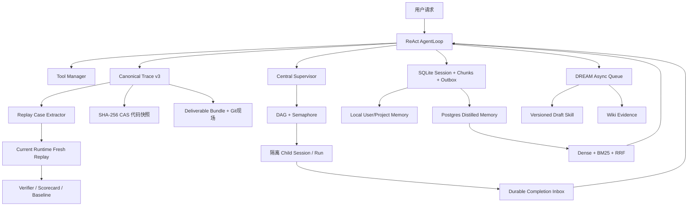

# BioCoreAgent 简历目标全面升级报告

> 审计日期：2026-07-30
> 原则：只写代码、测试和可复现产物能够证明的事实。

## 一、结论

本轮已把 BioCoreAgent 从“多数架构存在，但若干简历表述超前”升级为一套有代码、有证据、有回归边界的科研 Agent Harness。

最重要的三个变化是：

1. 原先并没有 Postgres/语义向量长期记忆，现在已有可选 Postgres 三层记忆链路，并通过真实数据库和本地 SentenceTransformer 端到端验证。
2. 原先所谓“后台 Reviewer”实际同步阻塞，现在改为五阶段 DREAM 持久化异步队列；会话蒸馏 outbox 也不会再让最终交付等待 embedding。
3. 原先子 Agent 完成后仍依赖主模型主动轮询，现在 Job/Team 终态会进入按父会话隔离的 completion inbox，并在父 Agent 下一轮自动回注。

Trace、精确代码快照、Git 现场、Deliverable Bundle、Fresh Replay 和 Scorecard 也已形成完整审计闭环。

## 二、STAR 汇报

### Situation：升级前的问题

项目已有 ReAct 循环、多 Agent DAG、上下文压缩和本地记忆等主体能力，但简历目标与代码证据存在四类不一致：

- 文档明确写着“未实现 Postgres/语义 embedding”，目标却把它描述为已完成。
- Skill 沉淀函数名叫 Background Review，但在最终回答路径中同步执行。
- Supervisor 有独立子 session/run、日志和产物，却没有真正的完成结果自动回注。
- “HitRate@10 99.4%、MRR@10 0.67”只有阈值脚本，没有冻结集和真实 scorecard，不能作为实测成绩。

### Task：本轮目标

在不伪造指标、不覆盖用户工作区、不删除历史证据的前提下，完成五条工程链路：

- Runtime 状态机、Tool Manager、DAG 并发与三级降级。
- 本地 Trace、代码溯源、交付包与 Fresh Replay。
- RAG + Skill + Wiki 的显式/后台双通道沉淀。
- Supervisor 父子隔离、状态日志、产物列表与自动回注。
- SQLite 会话态、本地 User/Project 工作记忆、Postgres 蒸馏长期记忆和 Dense + BM25 检索。

### Action：实施内容

#### Runtime 与多 Agent

- 明确 Task、Job、Team 三个持久化生命周期状态机。
- 保留 9 个核心运行态和 `cancelled/blocked` 异常终态。
- 所有模型可见工具统一经过 Tool Manager：取消、allowlist、注册表、参数/路径校验、重复调用、高风险审批、执行、结果分类和证据更新。
- DAG 使用 `asyncio.Semaphore` 和终态事件驱动依赖；同步 Worker 通过 `asyncio.to_thread` 接入。
- 实现一级单任务超时、二级批量失败动态 DAG replan、三级全局超时强制部分合成。
- CLI 默认使用可硬终止的进程 Worker；线程模式保留协作取消边界。

#### 审计、代码溯源与回放

- Canonical Trace v3 使用版本化事件信封，记录脱敏用户输入、模型/工具事件、审批、异常恢复、产物和唯一终态。
- CAS 以 SHA-256 保存交付时的实际代码内容；文件之后被修改或路径失效，仍能按 object id 找回。
- 每次 Run 保存 Git HEAD/branch/remote/status、staged/unstaged dirty patch 和 before/after 哈希。
- Deliverable Bundle 保存产物哈希、输入哈希、命令、工作目录、执行状态、Python/R/container 环境、代码 manifest 和 trace/Git 血缘。
- 历史 Trace 只能抽取 `draft` replay case；`ready` case 在新隔离工作区由当前 Runtime 真实执行，产生 fresh trace。
- Verifier 使用 50/20/15/10/5 权重评分，并提供显式 baseline update 与长期 diff。

#### 记忆与知识沉淀

- SQLite 同时保存 session、规范化消息、不可变 conversation chunk 和 retryable distillation outbox，并保留 JSON 镜像。
- 新增独立本地 User/Project 工作记忆 SQLite，并镜像为 Markdown。
- 新增可选 Postgres 蒸馏长期记忆，保存作用域、事实、embedding、可靠性、状态与原消息 evidence。
- 使用 `all-MiniLM-L6-v2` Dense、精确 BM25 和 RRF；没有 scope 的客户端只能读取显式全局行，不能看到所有租户。
- embedding 模型名写入每行；不同模型生成的向量不会混算。
- memory outbox 后台 drain，Postgres 或 embedding 暂时失败时保留 pending 与错误，最终回答不被阻塞。
- 新增 DREAM：Detect → Review → Extract → Apply → Monitor 五阶段 durable 异步任务；未验证或失败回合被拒绝。
- 同主题每 3 条成功观察生成或迭代一个 `draft` Skill，旧版自动归档并生成 Wiki 证据。

#### Supervisor 自动回注

- Job 和 Team 保存 `parent_session_id`。
- 终态结果、错误和 artifact path 写入 recipient-scoped completion inbox。
- 父 Agent 用持久化 cursor 只消费一次，并把完整回注内容保存进父 session history。
- 一个父会话的读取不会消费或暴露另一个父会话的结果。

### Result：验证结果

| 验证项 | 结果 | 证据 |
|---|---:|---|
| 全量 Python 回归 | 270 passed，9 skipped | `python -m pytest -q` |
| 固定 Harness 回归 | 14/14；预算内 100%；verifier 100% | `artifacts/harness-regression-v2.json` |
| Postgres hash 分支集成 | 2/2 passed | `tests/test_postgres_memory_integration.py` |
| Postgres SentenceTransformer 分支集成 | 2/2 passed | 同上，真实本地模型 |
| 记忆资格集 | HitRate@10 100%；MRR@10 1.000；leakage 0 | `artifacts/memory-recall-synthetic-v1.json` |
| Replay smoke | 100/100；hard gates passed | Fresh trace + scorecard |
| 新增关键文件静态检查 | Ruff F/E9 passed | 新模块与评测脚本 |
| 仓库安全检查 | passed | `scripts/check_repo_safety.py` |

记忆结果超过 99.4%/0.67 门槛，但该 200 查询集合是冻结的合成命名实体工程资格集，不是开放域 QA，也不是自然产生的真实用户查询。真实历史会话已经能抽取 draft，仍需独立人工标注后才能发布真实用户指标。

## 三、当前架构

## 四、简历真实性边界

现在可以写：

- 三层记忆、Postgres 蒸馏长期记忆和本地 SentenceTransformer Dense + BM25 + RRF。
- 200 条冻结合成资格集达到 HitRate@10 100%、MRR@10 1.000、scope leakage 0。
- 五阶段 DREAM 持久化异步沉淀。
- Canonical Trace、CAS 精确代码快照、Git dirty 现场、Fresh Replay 与 Scorecard。
- Supervisor 父子会话隔离和 durable completion inbox 自动回注。

仍不能写：

- 使用 pgvector ANN；当前 embedding 保存为 JSONB，并在过滤候选集上做精确余弦。
- 真实用户或开放域记忆检索达到 100%/1.000。
- 线程 Worker 可以被 Python 安全强杀；硬终止只适用于进程 Worker。
- BixBench 官方外部 LLM judge 为 76%；当前是本地 direct verifier。

## 五、证据入口

- `docs/resume/biocoreagent_resume_star.md`
- `docs/resume/goal_completion_audit.md`
- `docs/runtime_state_machine.md`
- `docs/trace_replay_architecture.md`
- `docs/memory_architecture.md`
- `docs/knowledge_sedimentation.md`
- `artifacts/harness-regression-v2.json`
- `artifacts/memory-recall-synthetic-v1.json`
- `benchmarks/memory_recall/synthetic-v1/`
- `tests/test_multiagent_orchestrator.py`
- `tests/test_replay_evidence.py`
- `tests/test_memory_pipeline.py`
- `tests/test_postgres_memory_integration.py`
