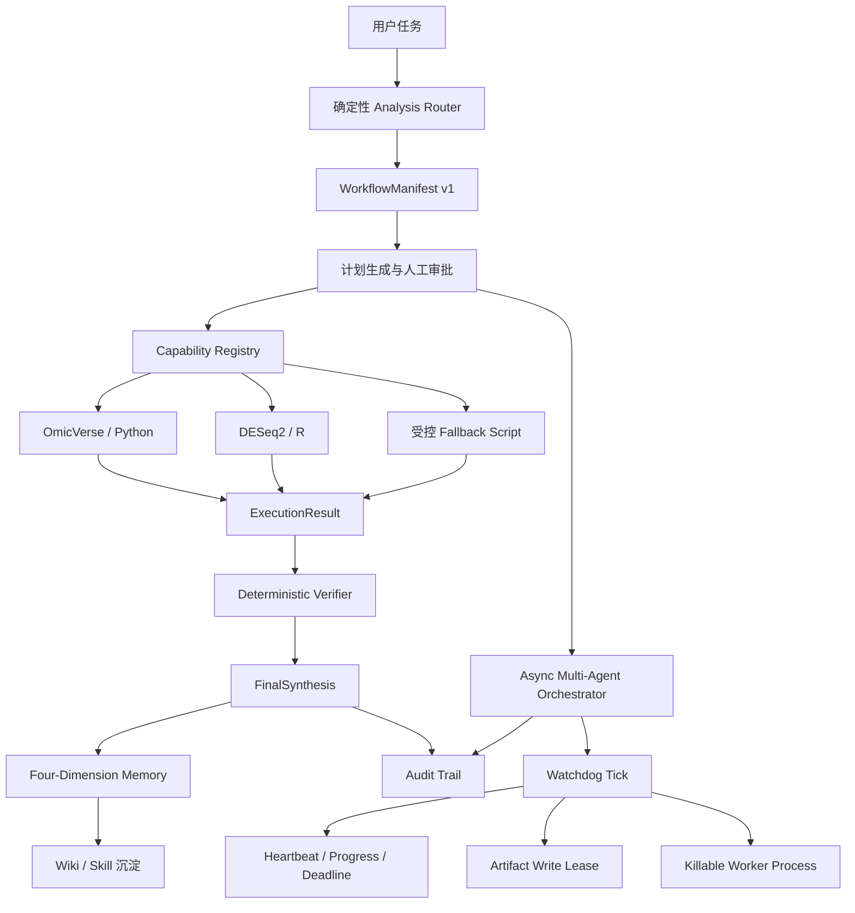

# BioCoreAgent 稳定性架构升级

## 1. 操作步骤

1. 用户提交科研分析任务。
2. `analysis_router` 识别任务类型、风险、首选后端和是否需要计划。
3. 运行时创建 `WorkflowManifest`，记录任务与路由证据。
4. 计划生成后等待用户审批，审批前不执行正式分析后端。
5. 运行时通过 `CapabilityContract` 调用确定性 Python、R 或 OmicVerse 工具。
6. Verifier 检查退出状态、结果文件、文件哈希和关键产物。
7. 多 Agent 任务由 Watchdog 监控心跳、进展、截止时间与写入租约。
8. 最终结果只有在执行和验证均通过时才能标记为 `completed`。
9. 经过验证且重复复用的经验进入 Wiki、Skill 或长期记忆。

## 2. 总体架构



## 3. 结构化 Workflow IR

过去的分析链条由多个字典和工具输出临时拼接，模型可能误解状态。现在使用 Pydantic 定义统一中间表示：

```text
TaskEnvelope
→ RouteDecision
→ ApprovedPlan
→ CapabilityInvocation
→ ExecutionResult
→ VerificationResult
→ FinalSynthesis
```

Manifest 持久化在：

```text
.biocoreagent/workflows/<workflow_id>/manifest.json
```

选择 Pydantic 的原因：

- 严格拒绝缺失字段和未知字段。
- 可以生成稳定 JSON 协议，作为模块间契约。
- `completed` 状态可以通过跨字段校验，强制要求成功执行、验证通过和证据路径。
- 相比模型自由生成文本，结构化状态更容易测试、审计和恢复。

模型只负责理解语义、提出假设和生成候选方案。执行状态、文件存在性、哈希和验证结论由运行时填写。

## 4. Capability 确定性边界

统一契约包含：

```python
CapabilityContract(
    input_schema,
    output_schema,
    executor,
    verifier,
    fallback,
    risk_level,
    approval_policy,
)
```

当前 bulk RNA-seq 已注册 OmicVerse 和 DESeq2 能力。执行器只能调用已注册工具，Verifier 独立检查完整结果表、显著结果表和 summary。后端即使返回 `status=completed`，缺少结果文件时仍会被降级为失败。

这个选型解决的是生成式不确定性问题：

- LLM 处理用户意图、实验假设和缺失信息。
- 确定性算法处理 counts、Fold Change、p 值和 FDR。
- Verifier 处理“是否真的完成”。
- Human-in-the-loop 处理计划、环境修改、SSH 和覆盖结果等高风险操作。

## 5. Watchdog 多 Agent 运行时

主调度器继续使用 asyncio、DAG 和 Semaphore。每 500 ms 执行一次 Watchdog Tick，检查：

- `heartbeat_at`：Worker 是否仍可观察。
- `progress_at`：任务是否有实际进展。
- `deadline_at`：是否超过单任务截止时间。
- `artifact_paths`：是否与其他 Agent 的写入租约冲突。
- 团队失败比例和全局超时：是否需要 replan 或强制综合。

CLI 创建的子 Agent 默认运行在独立 Python 进程中。超时后终止进程树，避免 `asyncio.to_thread` 已超时但底层线程继续运行。嵌入式测试和不可序列化工厂仍兼容线程模式，但线程模式只能逻辑取消，不能强制杀死 Python 线程。

写入租约采用带 TTL 的 JSON 状态，不删除历史租约：

```text
.biocoreagent/multiagent/write_leases/
```

Agent 必须在任务定义中声明 `artifact_paths`。同一路径已有有效租约时，后来的任务进入 `blocked`，由 Supervisor 保留最终决策权。

## 6. 四维可解释记忆

长期记忆保留 BM25、Dense Hash 和 RRF 召回，再执行四维排序：

```text
score =
  relevance   × 0.45
+ recency     × 0.15
+ reliability × 0.25
+ scope_fit   × 0.15
```

- `relevance`：BM25 名次和 Dense Hash 相似度。
- `recency`：默认 90 天半衰期。
- `reliability`：验证反馈和复用成功情况。
- `scope_fit`：任务范围、领域标签和 Agent 角色是否匹配。

每条检索结果返回分数拆解及权重。验证成功会提升可靠性，验证失败会降低可靠性。低保留价值记忆标记为 `forgotten`，不会物理删除；冲突旧事实标记为 `superseded` 并记录替代内容。用户偏好和关键决策默认受保护。

重复成功流程仍由 Sedimentation Reviewer 在达到阈值后生成版本化 Draft Skill 和 Wiki 记录，人工审核后再作为可信流程复用。

## 7. 工程限制

- 写入冲突依赖任务提前声明 `artifact_paths`，后续可在 `write_file`、`patch_file` 工具层自动申请租约。
- 进程 Worker 会继承本机环境变量，但配置文件不保存 API Key。
- 线程兼容模式无法强制终止底层模型调用，因此生产 CLI 默认使用进程模式。
- 四维检索的初始权重是工程默认值，需要通过真实检索数据持续校准。

## 8. 可能的面试问题

### Q1：为什么不让 LLM 一次生成并执行完整工作流？

高风险科研任务需要区分“建议”和“事实”。LLM 可以生成方案，但执行状态和统计结果必须由确定性运行时产生并验证。

### Q2：为什么保留 asyncio，又增加 Watchdog Tick？

asyncio 适合事件驱动并发，Watchdog Tick 适合统一检查 deadline、心跳和租约。两者结合可以保持低延迟，同时获得周期性容错。

### Q3：`asyncio.wait_for` 为什么还不够？

它只能取消等待协程，不能杀死 `asyncio.to_thread` 中正在运行的 Python 线程。生产 Worker 使用独立进程后才能执行硬终止。

### Q4：Agent 冲突如何解决？

执行前申请产物路径写入租约。发生冲突时按规则阻止后来的任务，最终决策由中心 Supervisor 做出，不采用 Agent 自由投票。

### Q5：为什么不用纯向量数据库做记忆？

本地 Agent 更强调可调试和错误溯源。BM25、Hash Vector 和四维分数都能展示排序原因，也避免引入额外模型服务；未来仍可替换 relevance 子模块。

### Q6：如何防止“任务失败但模型声称成功”？

`WorkflowManifest` 的跨字段校验要求至少一个完成的执行、通过的验证和真实证据路径，否则无法持久化 `completed`。
